# Indonesia Pulp Deforestation — Repository Audit Report
**Generated:** 2026-05-15  
**Purpose:** Pre-targets replication package audit  
**Authors of codebase:** Robert Heilmayr and Jason Jon Benedict

---

## Executive Summary

The repository has two parallel analytical layers:

1. **Folders 02–05 (organic evolution):** A sprawling set of ~30 R scripts that developed the analysis iteratively. Many are partially commented-out or prototype-stage.
2. **Folder 06_clean_scripts (consolidation):** Four scripts that attempt to consolidate the core pipeline. Coverage is incomplete — only land-use change tabulation and the deforestation-timing figure are fully reproduced. The new ML-based spatial model (scripts 21 and 22) and the MAI yield analysis (script 08) have **no counterpart in 06_clean_scripts at all**.

The current state is not ready for a targets pipeline without significant harmonisation. Key problems are flagged in each section below.

---

## Repository Structure (Full File List)

```
scripts/
├── 001_misc/
│   ├── 001_color_palettes.R
│   └── 002_pulp_trade_data_2021.R
├── 01_data_explore/               (10 exploratory scripts — not audited for replication)
├── 02_data_cleaning/
│   ├── 01_clean_psdh_comp_names.R
│   ├── 02_sipnbp_hti_data_cleanup.R
│   ├── 03_sipnbp_hph_data_cleanup.R
│   ├── 04_clean_hti.R
│   ├── 04_merge_ws_data.R
│   ├── 05_hti_group_cleaning.R
│   ├── 06_gaveau_harvests.R          *** KEY: produces hti_harvest_yr.csv
│   ├── 07_ports_cleaning.R
│   ├── 08_centroid_mill_distance_calc.R
│   ├── 08_clean_od_outputs.R
│   ├── 09_gaveau_hti_union.py
│   ├── 10_pulp_expansion_model_variables.R
│   └── pulp_expansion_model_variables_1km.R  *** KEY: produces 1km model inputs
├── 03_data_preprocessing/         (Python scripts + 1 R cleanup)
├── 04_data_analysis/              (22 scripts — main analytical layer)
├── 05_figures/
│   └── 01_summary_figure.R
└── 06_clean_scripts/              (4 scripts — partial consolidation)
    ├── 01_data_prep.R
    ├── 02_deforestation_timing.R
    ├── 03_land_use_change.R
    └── 04_land_use_traj_plots.R
```

---

## Section 1: Original-Clean Gap Analysis

### 1.1 What 06_clean_scripts Covers

| Clean Script | Analysis Covered | Replaces (04_data_analysis) |
|---|---|---|
| `01_data_prep.R` | Core data wrangling: HTI land-use change table + HTI/non-HTI pulp conversion tables | Partial overlap with `11_hti_lu_change_analysis.R` and `10_hti_defor_analysis.R` |
| `02_deforestation_timing.R` | Bar chart of deforestation class by mill ownership group | `10_hti_defor_analysis.R` (figure only; partial) |
| `03_land_use_change.R` | Per-concession land-use trajectories using 2024 IOPP/ITP GDB data | `11_hti_lu_change_analysis.R` (partial, newer data) |
| `04_land_use_traj_plots.R` | Per-concession area-stacked plots (loop over all concessions) | `11_hti_lu_change_analysis.R` (figure loop only) |

### 1.2 Scripts in 04_data_analysis NOT Covered by 06_clean_scripts

The following analysis scripts have **no equivalent in 06_clean_scripts** and represent gaps for the replication package:

| Script | Purpose | Status |
|---|---|---|
| `08_calc_mai.R` | MAI yield analysis, fixest regressions, exports `key_parameters.csv` | **UNCOVERED — critical upstream dependency** |
| `12_paper_stats.R` | All in-text statistics for the manuscript | **UNCOVERED** |
| `15_pulp_defor_prices.R` | Pulp price vs. deforestation figures | **UNCOVERED** |
| `17_defor_elasticity.R` | Deforestation elasticity regressions (fixest) | **UNCOVERED** |
| `20_pulp_expansion_table.R` | Table of pulp expansion areas 2001–2022 | **UNCOVERED** |
| `21_pulp_expansion_model.R` | Random forest spatial model (tidymodels/ranger) | **UNCOVERED — new methodology** |
| `22_pulp_expansion_scenarios.R` | Scenario projections from RF model | **UNCOVERED — downstream of 21** |
| `01_def_temporal_trends.R` | Temporal deforestation trends | **UNCOVERED** |
| `02_mill_demand.R` | Mill demand analysis | **UNCOVERED** |
| `06_burn_areas_peat.R` | Burn areas on peat | **UNCOVERED** |
| `09_hti_area_calculations.R` | HTI concession areas, burn/peat fractions | **UNCOVERED** |
| `14_pulp_expansion_peat.R` | Pulp expansion on peat soils | **UNCOVERED** |

**05_figures:**

| Script | Purpose | Status |
|---|---|---|
| `01_summary_figure.R` | Three-panel summary figure (deforestation + wood supply + policy timeline) | **UNCOVERED** — uses AWS S3 data, old data paths |

### 1.3 Orphan Outputs (Outputs Not Traceable to Any 06_clean_scripts Logic)

The following output files are referenced as **inputs** by other scripts but have no generating script in `06_clean_scripts`:

| Orphan Output File | Referenced In | Generating Script (04/ or 02/) |
|---|---|---|
| `remote/01_data/02_out/tables/hti_grps_zdc_pulp_conv_areas.csv` | `12_paper_stats.R` | Not clearly identified — possible `10_hti_defor_analysis.R` |
| `remote/01_data/02_out/tables/gaveau_annual_pulp_areas.csv` | `12_paper_stats.R` | `11_hti_lu_change_analysis.R` (commented-out write) |
| `remote/01_data/02_out/tables/hti_harvest_yr.csv` | `08_calc_mai.R` | `02_data_cleaning/06_gaveau_harvests.R` |
| `remote/01_data/04_results/key_parameters.csv` | `12_paper_stats.R`, `22_pulp_expansion_scenarios.R` | `08_calc_mai.R` |
| `remote/01_data/02_out/tables/hti_mai.csv` | `17_defor_elasticity.R` | `08_calc_mai.R` |
| `remote/01_data/02_out/tables/idn_pulp_conversion_hti_nonhti_gaveau.csv` | `12_paper_stats.R`, `20_pulp_expansion_table.R` | `01_data_prep.R` (writes `..._treemap.csv`; **filename mismatch**) |
| `remote/01_data/02_out/tables/idn_deforestation_hti_nonhti_treemap.csv` | `15_pulp_defor_prices.R` | Not found — **unresolved** |
| `remote/01_data/02_out/tables/tbl_long_pulp_clearing_gfc_forest.csv` | `17_defor_elasticity.R` | Not found — **unresolved** |
| `remote/01_data/02_out/tables/centroids_mills_cost.csv` | `17_defor_elasticity.R` | `02_data_cleaning/08_centroid_mill_distance_calc.R` or `17_centroids_mills_cost.R` |
| `remote/01_data/02_out/tables/gaez_grid_share.csv` | `17_defor_elasticity.R` | `04_data_analysis/18_gaez_classes_hti_centroids.R` |
| `remote/01_data/02_out/tables/pulp_predictions.csv` | `22_pulp_expansion_scenarios.R` | `21_pulp_expansion_model.R` |
| `remote/01_data/02_out/tables/pulp_exp_model_var_1km_2017.csv` | `21_pulp_expansion_model.R` | `02_data_cleaning/pulp_expansion_model_variables_1km.R` |
| `remote/01_data/02_out/tables/pulp_exp_model_var_1km_2022.csv` | `21_pulp_expansion_model.R` | `02_data_cleaning/pulp_expansion_model_variables_1km.R` |
| `remote/01_data/02_out/models/rf_final_fit.rds` | (intended for `22_...` reload) | `21_pulp_expansion_model.R` |
| `remote/01_data/04_results/figures/SI_f4_auc.png` | `21_pulp_expansion_model.R` | Same script |
| `remote/01_data/04_results/figures/pulp_expansion_map.html` | `21_pulp_expansion_model.R` | Same script |
| `remote/01_data/04_results/figures/fig_expansion_combined.png` | `22_pulp_expansion_scenarios.R` | Same script |

**Critical filename mismatch:** `01_data_prep.R` writes `idn_pulp_conversion_hti_nonhti_treemap.csv`, but `12_paper_stats.R` reads `idn_pulp_conversion_hti_nonhti_gaveau.csv`. These are different filenames pointing to what should be the same data, indicating the clean scripts and the paper-stats script are not currently wired together.

### 1.4 Data Source Inconsistencies Across Versions

| Variable | 06_clean_scripts | 04_data_analysis |
|---|---|---|
| HTI shapefile | `IUPHHK_HTI_20230314_proj.shp` (with filter `H-0553`) | Some scripts use `IUPHHK_HTI_TRASE_20230314_proj.shp`; others use `IUPHHK_HT_proj.shp` |
| Pulp/harvest data | IOPP/ITP from `data.gdb` (Gaveau 2024) in `03_land_use_change.R` | Older CSV-based Gaveau classes in 04 scripts |
| `04_land_use_traj_plots.R` | References `concession_fnf_traj` (undefined) | Not defined anywhere in 06 scripts — **runtime error** |

---

## Section 2: Input/Output Lineage Matrix

### 06_clean_scripts

| Clean Script | Primary Input(s) | Derived Output(s) | Original Script(s) Replaced |
|---|---|---|---|
| `01_data_prep.R` | `gaveau/*gaveau_classes.csv` (batch), `gfc_peat/*.csv` (batch), `gfc_ttm/*.csv` (batch), `samples_hti_id.csv`, `IUPHHK_HTI_TRASE_20230314_proj.shp`, `PULP_WOOD_SUPPLY_CLEAN_ALL_ALIGNED_2020_2022.csv`, `HTI_LICENSE_DATES.csv`, `ALIGNED_NAMES_GROUP_HTI.csv`, `MILLS_EXPORTERS_20200405.xlsx`, `idn_kabupaten_big.shp`, `hti_company_ownership_reclass.csv`, `pulp_annual_defor_forest_id.csv`, `pulp_annual_defor_non-forest_id.csv` | `hti_land_use_change_areas.csv`, `hti_grps_deforestation_timing.csv`, `idn_pulp_conversion_hti_nonhti_treemap.csv` | Partially replaces `11_hti_lu_change_analysis.R`, `10_hti_defor_analysis.R` |
| `02_deforestation_timing.R` | `hti_grps_deforestation_timing.csv` (from `01_data_prep.R`), `001_color_palettes.R` | `supplier_groups_defor_class_plot_rev9.png` | Partially replaces `10_hti_defor_analysis.R` (figure only) |
| `03_land_use_change.R` | `HTI_LICENSE_DATES.csv`, `IUPHHK_HTI_20230314_proj.shp`, `PULP_WOOD_SUPPLY_CLEAN_ALL_ALIGNED_2020_2022.csv`, `ttm_classes_by_concession.csv`, `data.gdb` (layer: `ioppitp_hti_union`) | None written to disk (incomplete — `lu_expanded_tbl` built but not saved; references undefined `concession_fnf_traj`) | Intended to replace `11_hti_lu_change_analysis.R` — **INCOMPLETE** |
| `04_land_use_traj_plots.R` | `hti_land_use_change_areas.csv`, `001_color_palettes.R` | Per-concession PNG files at `plots/001_figures/lu_traj_plots_all/*.png` (one per HTI concession, ~200+ files) | Replaces the figure loop in `11_hti_lu_change_analysis.R` |

### Key 04_data_analysis Scripts (not covered by 06_clean_scripts)

| Script | Primary Input(s) | Derived Output(s) | Notes |
|---|---|---|---|
| `08_calc_mai.R` | `hti_harvest_yr.csv`, `RPBBI_2015_2019_compiled.xlsx`, `RPBBI_2020_compiled.xlsx`, `RPBBI_2021_compiled.xlsx` | `hti_mai.csv`, `key_parameters.csv`, `yield_growth_table.docx`, `mai_diagnostic_plots.png` | Critical upstream dependency; exports MAI parameters consumed by `12_paper_stats.R` and `22_pulp_expansion_scenarios.R` |
| `12_paper_stats.R` | `idn_kabupaten_big.shp`, `IUPHHK_HTI_TRASE_20230314_proj.shp`, `PULP_WOOD_SUPPLY_CLEAN_ALL_ALIGNED_2020_2022.csv`, `RPBBI_2015_2019/2020/2021/2022_compiled.xlsx` (4 files), `idn_pulp_conversion_hti_nonhti_gaveau.csv`, `IDN_2001_2022 landcover change...xlsx`, `pulp_annual_area_hti_only.csv`, `pulp_annual_area_id.csv`, `ALIGNED_NAMES_GROUP_HTI_reclassed.csv`, `hti_grps_zdc_pulp_conv_areas.csv`, `gaveau_annual_pulp_areas.csv`, `idn_pulp_annual_expansion_peat_mineral_soils.csv`, `annual_pulp_shr_prod.xlsx`, `gfc_ttm/*.csv` (batch), `key_parameters.csv`, `MILLS_EXPORTERS_20200405.xlsx` | `pulp_expansion_areas_2001_2022.csv` | All stats printed to console via `print()` |
| `17_defor_elasticity.R` | `tbl_long_pulp_clearing_gfc_forest.csv`, `Fastmarkets_2025_01_14-103617.xlsx`, `WRQ_pulpwood_prices.xlsx`, `FRED_CCUSSP02IDM650N.csv`, `FRED_IDNCPIALLAINMEI.csv`, `centroids_mills_cost.csv`, `gaez_grid_share.csv`, `gaez_hti_areas.csv`, `hti_mai.csv`, `grid_10km_adm_prov_kab_kec.csv` | Regression tables (modelsummary, to console/docx) | `fixest` panel models |
| `21_pulp_expansion_model.R` | `pulp_exp_model_var_1km_2017.csv`, `pulp_exp_model_var_1km_2022.csv`, `idn_kabupaten_big.shp` | `rf_final_fit.rds`, `pulp_predictions.csv`, `SI_f4_auc.png`, `pulp_expansion_map.html` | Random forest via tidymodels/ranger |
| `22_pulp_expansion_scenarios.R` | `pulp_predictions.csv`, `idn_kabupaten_big.shp`, `key_parameters.csv` | `fig_expansion_map.png`, `fig_expansion_combined.png`, `pulp_expansion_scenarios.html` | Scenario projections from RF model |
| `15_pulp_defor_prices.R` | `idn_deforestation_hti_nonhti_treemap.csv`, `pulp_expansion.csv`, `Fastmarkets_2025_01_14-103617.xlsx`, `WPU0911_annual.csv`, `MILL_PRODUCTION_2015_2024.xlsx`, `MILLS_EXPORTERS_20200405.xlsx` | Figures to console/disk (paths not fully shown) | Price-deforestation relationship |
| `05_figures/01_summary_figure.R` | AWS S3 data (wood supply), `data_lookup_table.csv`, `HTI_LICENSE_DATES.csv`, `ALIGNED_NAMES_GROUP_HTI.csv`, `IUPHHK_HT_proj.shp`, `pulp_annual_defor_forest/non-forest_id.csv`, `plot_data.csv` (Obidzinski), `pulp_exports_wits.csv`, `WPU0911_FRED.csv`, `annual_pulp_shr_prod.xlsx`, `idn_kabupaten_big.shp`, `policy_timeline_cats_rev1.csv` | `fig_0X_summary_figure_updated.png`, `fig_0X_summary_figure_rev4.svg` | Uses `aws.s3`; requires credentials |

### Key 02_data_cleaning Scripts (Upstream of Analysis)

| Script | Primary Input(s) | Derived Output(s) |
|---|---|---|
| `06_gaveau_harvests.R` | `IDN_ITPHarvesting_V20220208.shp`, `long_rotations_Checked_20240503.shp`, `IUPHHK_HT_proj.shp`, `gambut_indonesia_2019.shp`, `treemap_long_rotation_blocks_climate_2000_2024.csv` | `hti_harvest_yr.csv` (implied; written at end of script) |
| `pulp_expansion_model_variables_1km.R` | GEE batch CSVs (`kalisuma_topo_*`, `kalisuma_landuse_*`, `kalisuma_riverdist_*`, `mill_dist_*`, `kalisuma_aee_embed_*`), `kalisuma_1km_grid_pts.csv`, `kalisuma_1km_grid.shp`, `PNUNJUKKWSHUTAN_AR_250K_2021_06.shp` | `pulp_exp_model_var_1km_2017.csv`, `pulp_exp_model_var_1km_2022.csv`, `var_table_summary_stats.csv` |
| `10_pulp_expansion_model_variables.R` | `kalisuma_10km_grid_centroids_proj.shp`, GEE batch CSVs (10km versions), `centroids_mills_dist_2017.csv`, `centroids_mills_dist_2022.csv`, `PNUNJUKKWSHUTAN_AR_250K_2021_06.shp` | `pulp_exp_model_var_2017.csv`, `pulp_exp_model_var_2022.csv` (superseded by 1km version) |

---

## Section 3: Data Flow Visualization (Mermaid.js)

```mermaid
flowchart TD
    %% ── RAW DATA SOURCES ──────────────────────────────────────────────
    subgraph RAW ["Raw Data (remote/01_data/01_in/)"]
        direction TB
        R1([HTI Shapefile\nKLHK 2023])
        R2([Wood Supply RPBBI\n2015–2022 xlsx])
        R3([HTI License Dates\nHTI_LICENSE_DATES.csv])
        R4([Supplier Groups\nALIGNED_NAMES_GROUP_HTI.csv])
        R5([Mill Info\nMILLS_EXPORTERS.xlsx])
        R6([Kabupaten Shapefile\nidn_kabupaten_big.shp])
        R7([ITP Harvest Polygons\nIDN_ITPHarvesting.shp])
        R8([Gaveau Land Cover\nIDN_2001_2022 xlsx])
        R9([IOPP/ITP GDB\nGaveau data.gdb 2024])
        R10([Fastmarkets / RISI\nPulp Prices xlsx])
        R11([FRED / WRQ\nPulp Prices csv])
        R12([Kawasan Hutan\nPNUNJUKKWSHUTAN.shp])
        R13([Peat Map\nMoA 2019 shp])
    end

    %% ── GEE EXTRACTED DATA ────────────────────────────────────────────
    subgraph GEE ["GEE Extracted (remote/01_data/02_out/gee/)"]
        direction TB
        G1[(gaveau/*gaveau_classes.csv\nTreeMap land-use classes)]
        G2[(gfc_ttm/*.csv\nTreeMap-modified GFC)]
        G3[(gfc_peat/*.csv\nPeat + Margono primary)]
        G4[(pulp_annual_defor_forest_id.csv\npulp_annual_defor_non-forest_id.csv)]
        G5[(pulp_annual_area_hti_only.csv\npulp_annual_area_id.csv)]
        G6[(GEE batch CSVs\n1km grid: topo, landuse,\nriverdist, AEE embeddings,\nmill distances)]
        G7[(ttm_classes_by_concession.csv)]
        G8[(idn_pulp_annual_expansion_peat_mineral_soils.csv)]
        G9[(samples/samples_hti_id.csv)]
    end

    %% ── DATA CLEANING ────────────────────────────────────────────────
    subgraph CLEAN ["02_data_cleaning"]
        C1[06_gaveau_harvests.R]
        C2[pulp_expansion_model_variables_1km.R]
    end

    %% ── INTERMEDIATE TABLES ──────────────────────────────────────────
    subgraph INT ["Intermediate Tables (remote/01_data/02_out/tables/)"]
        direction TB
        I1[(hti_land_use_change_areas.csv)]
        I2[(hti_grps_deforestation_timing.csv)]
        I3[(idn_pulp_conversion_hti_nonhti_treemap.csv)]
        I4[(hti_harvest_yr.csv)]
        I5[(pulp_exp_model_var_1km_2017.csv\npulp_exp_model_var_1km_2022.csv)]
        I6[(key_parameters.csv\ndmai, yield_growth, etc.)]
        I7[(hti_mai.csv)]
        I8[(pulp_expansion_areas_2001_2022.csv)]
        I9[(pulp_predictions.csv)]
        I10[(hti_grps_zdc_pulp_conv_areas.csv\nhti_company_ownership_reclass.csv)]
    end

    %% ── ANALYSIS SCRIPTS ─────────────────────────────────────────────
    subgraph ANALYSIS ["04_data_analysis / 06_clean_scripts"]
        A1[06_clean/01_data_prep.R]
        A2[06_clean/02_deforestation_timing.R]
        A3[06_clean/03_land_use_change.R]
        A4[06_clean/04_land_use_traj_plots.R]
        A5[08_calc_mai.R]
        A6[12_paper_stats.R]
        A7[17_defor_elasticity.R]
        A8[21_pulp_expansion_model.R]
        A9[22_pulp_expansion_scenarios.R]
        A10[15_pulp_defor_prices.R]
        A11[05_figures/01_summary_figure.R]
    end

    %% ── FINAL OUTPUTS ────────────────────────────────────────────────
    subgraph OUT ["Final Outputs"]
        direction TB
        O1{{supplier_groups_defor_class_plot_rev9.png}}
        O2{{lu_traj_plots_all/*.png\n~200 per-concession PNGs}}
        O3{{yield_growth_table.docx\nmai_diagnostic_plots.png}}
        O4{{Manuscript statistics\nprinted to console}}
        O5{{Elasticity regression tables}}
        O6{{rf_final_fit.rds\nSI_f4_auc.png\npulp_expansion_map.html}}
        O7{{fig_expansion_map.png\nfig_expansion_combined.png\nscenario_map.html}}
        O8{{fig_0X_summary_figure.png/.svg}}
    end

    %% ── CONNECTIONS ─────────────────────────────────────────────────
    R1 & R2 & R3 & R4 & R5 & R6 --> A1
    G1 & G2 & G3 & G4 & G9 --> A1
    R10 --> I10
    A1 --> I1 & I2 & I3
    I2 --> A2
    A2 --> O1
    I1 --> A4
    A4 --> O2
    G7 & R9 --> A3
    A3 -.->|incomplete| I1

    R7 & R13 --> C1
    C1 --> I4
    G6 & R12 --> C2
    C2 --> I5

    I4 & R2 --> A5
    A5 --> I6 & I7 & O3

    I3 & G4 & G5 & G8 & R8 & R2 & I6 & I10 --> A6
    A6 --> I8 & O4

    I5 --> A8
    A8 --> I6 & I9 & O6

    I9 & I6 --> A9
    A9 --> O7

    I7 & R10 & R11 --> A7
    A7 --> O5

    G4 & R2 & R8 --> A11
    A11 --> O8

    %% ── STYLING ─────────────────────────────────────────────────────
    classDef raw fill:#d4edda,stroke:#28a745,color:#000
    classDef gee fill:#cce5ff,stroke:#004085,color:#000
    classDef inter fill:#fff3cd,stroke:#856404,color:#000
    classDef script fill:#f8d7da,stroke:#721c24,color:#000
    classDef output fill:#e2e3e5,stroke:#383d41,color:#000

    class R1,R2,R3,R4,R5,R6,R7,R8,R9,R10,R11,R12,R13 raw
    class G1,G2,G3,G4,G5,G6,G7,G8,G9 gee
    class I1,I2,I3,I4,I5,I6,I7,I8,I9,I10 inter
    class A1,A2,A3,A4,A5,A6,A7,A8,A9,A10,A11,C1,C2 script
    class O1,O2,O3,O4,O5,O6,O7,O8 output
```



---

## Section 4: Manuscript Metric Inventory

All statistics below are generated by `print()`, `cat()`, inline arithmetic with `%>% print()`, or `summary()` without being saved to disk. These are **"naked" outputs** that need to be either written to a file or wrapped in a targets object for a replication package.

### 4.1 Script: `04_data_analysis/12_paper_stats.R`

| Statistic / Model | Code / Function | Line(s) | Intended for Paper? | Saved? |
|---|---|---|---|---|
| Annual pulp expansion areas table (2001–2022) | `print()` on `annual_pulp_areas` | ~166 | Yes (Table/SI) | Yes → `pulp_expansion_areas_2001_2022.csv` |
| Share of pulp deforestation over total 2001–2011 | `print()` on `pulp_def_share_2001_2011` | ~176–185 | Yes — manuscript line 24 | **No** |
| Share of palm deforestation over total 2001–2011 | `print()` on `palm_def_share_2001_2011` | ~179–185 | Yes | **No** |
| Forest conversion to pulp 2001–2011 total | `sum() %>% print()` on `annual_conv` | ~213 | Yes — manuscript "735,000 ha" | **No** |
| 2011 peak conversion | `print()` on `conv_2011` | ~219 | Yes — manuscript line 14 | **No** |
| 2017 valley conversion | `print()` on `conv_2017` | ~220 | Yes — manuscript line 14 | **No** |
| % change 2011–2017 (−95%) | `early_change %>% print()` | ~222 | Yes — manuscript line 14 | **No** |
| 2022 conversion level | `print()` on `conv_2022` | ~226 | Yes — manuscript line 16 | **No** |
| % change 2017–2022 (+372%) | `late_change %>% print()` | ~228 | Yes — manuscript line 16 | **No** |
| Overall change 2011–2022 | `overall_change %>% print()` | ~232 | Yes | **No** |
| Peat conversion 2017 | `print()` on `pulp_conv_2017` | ~246 | Yes | **No** |
| Peat conversion 2022 | `print()` on `pulp_conv_2022` | ~247 | Yes | **No** |
| % change peat conversion 2017–2022 | `overall_pulp_change %>% print()` | ~249 | Yes | **No** |
| Share of Kalimantan pulp deforestation since 2017 | `print()` on `kali_pulp_driven_defor` | ~261 | Yes | **No** |
| Pulp area 2000 | `print()` on `annual_pulp` | ~272 | Yes | **No** |
| Pulp expansion 2000–2015 | `pulp_change %>% print()` | ~277 | Yes — manuscript "1.62 million ha" | **No** |
| Annual wood demand 2022 | `print()` on `current_wood_demand` | ~280 | Yes — manuscript "47 million m3" | **No** |
| Remaining forest in HTI by type | `print()` on `undrained_peat_areas_hti` | ~293 | Yes — manuscript line 151 | **No** |
| ZDC violation total ha | `print()` on `total_violations` | ~307 | Yes — manuscript line 85 | **No** |
| Violations share of pulp expansion | `print()` on `violations_shr` | ~327 | Yes | **No** |
| Indirect violations (NGO-linked) | `print()` on `indirect_violations` | ~337 | Yes — manuscript line 88 | **No** |
| Indirect share | `print()` on `indirect_shr` | ~339 | Yes | **No** |
| Top 5 violators breakdown | `print()` on `violations_df` | ~355 | Yes | **No** |
| Capacity expansion % | `print()` on `cap_change` | ~442 | Yes — manuscript "91%" | **No** |
| Land demand for capacity expansion | `(area_demand <- ...)` | ~450 | Yes — manuscript "1.63 million ha" | **No** |
| Yield growth scenario share of demand met | `extra_production / new_wood_demand` | ~464 | Yes — manuscript "62%" | **No** |
| Pulp area within HTI vs. total | `print()` on `pulp_area_hti/id` | ~513–521 | Yes — SI | **No** |
| Share of pulpwood expansion in HTI | `print()` on `hti_pulpwood_expansion` | ~530 | Yes | **No** |
| HTI concession LU areas (Mha) | `print()` on `hti_conc_lu_areas` | ~592 | Yes — SI 5 | **No** |
| Share of pulp by island | `print()` on `pulp_share_island` | ~618 | Yes | **No** |
| Active HTI supplier count and share | `print()` on `active_hti_suppliers` | ~562 | Yes | **No** |
| Mean concession area (active suppliers) | `print(n=Inf)` on `hti_supp_to_mills_conc_avg_area` | ~653 | Yes | **No** |

### 4.2 Script: `04_data_analysis/08_calc_mai.R`

| Statistic / Model | Code / Function | Intended for Paper? | Saved? |
|---|---|---|---|
| Sector-wide MAI (m3/ha/yr) | `sector_mai <- ... %>% print()` | Yes — core parameter | Yes → `key_parameters.csv` |
| Alternative MAI specs (ignoring fire, dropping fire, winsorized) | `if_mai`, `hf_mai`, `rw_mai %>% print()` | Yes — robustness | **No** |
| Annual MAI by year (`year_mai`) | `print()` on `year_mai` | Yes — Figure | **No** |
| MAI in 2021 | `print()` on `mai_2021` | Yes | Yes → `key_parameters.csv` |
| OLS regression: `ln_mai ~ year` (no FE) | `feols()` + `summary()` | Yes — SI Table | No (modelsummary to docx) → `yield_growth_table.docx` |
| Base model: `ln_mai ~ controls + year | Supplier FE` | `feols()` + `summary()`, `confint()` | Yes — main result | Coef → `key_parameters.csv` |
| Trim, NoWin, RW, IF, HF robustness models | `feols()` + `summary()` ×5 | Yes — robustness | Docx only |
| Production coverage (share with harvest data) | `print()` on `prod_coverage` | Yes — data quality | Yes → `key_parameters.csv` |
| Median observations per concession | `median()` | Yes | Yes → `key_parameters.csv` |
| Comparison to Hardiyanto CAGR (3.6%) | `cagr` | Yes | **No** |
| Reviewer diagnostic models (eq3–eq6) | `feols()` + diagnostic plots | Reviewer response | `mai_diagnostic_plots.png` |

### 4.3 Script: `04_data_analysis/22_pulp_expansion_scenarios.R`

| Statistic / Model | Code / Function | Intended for Paper? | Saved? |
|---|---|---|---|
| Productivity growth rate with CI | `cat(sprintf(...))` | Yes — paper text | **No** |
| MAI in 2028 (central + CI) | `cat(sprintf(...))` | Yes — paper text | **No** |
| Additional production from yield growth | `cat(sprintf(...))` | Yes — paper text | **No** |
| Share of demand met by productivity growth | `cat(sprintf(...))` | Yes — paper text | **No** |
| Total pulp expansion area (central + CI) | `cat(sprintf(...))` | Yes — paper text | **No** |
| Deforestation area (central + CI) | `cat(sprintf(...))` | Yes — paper text | **No** |
| Peatland conversion (central + CI) | `cat(sprintf(...))` | Yes — paper text | **No** |
| Expansion table by island × land type | `gt()` | Yes — Table in paper | **No** (rendered to viewer, not saved) |

### 4.4 Script: `04_data_analysis/17_defor_elasticity.R`

| Statistic / Model | Code / Function | Intended for Paper? | Saved? |
|---|---|---|---|
| Price conversion models (SA, Indo, NASC) | `lm()` + `summary()` | Yes — robustness | **No** |
| Panel regression: `defor ~ price + FE` | `feols()` + `modelsummary()` | Yes — main result | Partially via modelsummary |

### 4.5 Script: `04_data_analysis/21_pulp_expansion_model.R`

| Statistic / Model | Code / Function | Intended for Paper? | Saved? |
|---|---|---|---|
| % pixels dropped from NA | `message(sprintf(...))` | Yes — data quality note | **No** |
| CV tuning metrics (roc_auc, pr_auc) by hyperparams | `collect_metrics()` + `print(n=16)` | Yes — SI | **No** |
| Final test set metrics (roc_auc, pr_auc) | `collect_metrics(last_fit_result)` | Yes — main result | **No** |
| Brier score | `brier_class()` | Yes | **No** |
| Confusion matrix | `conf_mat()` + `tidy()` | Yes — SI | **No** |
| Variable importance (top 20) | `vip(num_features=20)` | Yes — Figure | **No** |
| Partial dependence plots | `pdp::partial()` + `ggplot()` | Yes — Figure | **No** |
| Spearman correlation (spatial calibration) | `cor(..., method="spearman")` | Yes | **No** |
| Predicted probability summary | `summary()` on `.pred_pulp` | Diagnostic | **No** |
| Best CV hyperparameters | `collect_metrics()` + `inner_join()` | Yes — SI | **No** |

### 4.6 Naked Variables / Models (Run but Not Saved or Exported)

The following objects are computed but exist only in the R session — they are not written to disk, not assigned to a named output in any function, and not returned from any targets pipeline. These are the highest-priority items to address:

1. **All manuscript statistics in `12_paper_stats.R`** (24+ named scalar values) — printed via `print()` and lost when the session ends.
2. **Scenario statistics in `22_pulp_expansion_scenarios.R`** (7 `cat(sprintf(...))` blocks) — written to console only.
3. **RF model evaluation metrics in `21_pulp_expansion_model.R`** (ROC-AUC, PR-AUC, Brier score, confusion matrix, VIP) — rendered to viewer/console only; `SI_f4_auc.png` is the only saved evaluation artifact.
4. **`expansion_gt`** (the gt table in `22_pulp_expansion_scenarios.R`) — rendered to the RStudio viewer but not saved as HTML, LaTeX, or PNG.
5. **`hti_conv` object** — built in `01_data_prep.R` and referenced in `12_paper_stats.R` as `test <- hti_conv %>% ...` but never written to disk.
6. **`gaveau_annual_pulp`** in `11_hti_lu_change_analysis.R` — built and used but the `write_csv()` call is commented out. Consumed by `12_paper_stats.R`.
7. **`tbl_long_pulp_clearing_gfc_forest.csv`** — read by `17_defor_elasticity.R` but its generating script is not identified in the repository.
8. **`idn_deforestation_hti_nonhti_treemap.csv`** — read by `15_pulp_defor_prices.R` but not clearly generated by any script in `06_clean_scripts` (close to `idn_pulp_conversion_hti_nonhti_treemap.csv` but different name and possibly different columns).
9. **Diagnostic MAI plots** in `08_calc_mai.R` (panels p1–p6) — saved as `mai_diagnostic_plots.png` but the reviewer-response models (`eq3`–`eq6` in levels) are not saved.
10. **`concession_fnf_traj`** in `06_clean_scripts/03_land_use_change.R` — referenced but **never defined**. This will cause a runtime error.

---

## Section 5: Recommendations for targets Package

Based on this audit, the following priorities are recommended before building a `targets` pipeline:

### 5.1 Critical Fixes (Blockers)

1. **Resolve `concession_fnf_traj` in `03_land_use_change.R`.** This object is used in `lu_expanded_tbl` but is never created. The script will fail at runtime. It is likely meant to be `concession_forest_traj`.

2. **Resolve filename mismatch.** `01_data_prep.R` writes `idn_pulp_conversion_hti_nonhti_treemap.csv`; `12_paper_stats.R` reads `idn_pulp_conversion_hti_nonhti_gaveau.csv`. Decide on a canonical name and update all readers.

3. **Identify the generating script for `tbl_long_pulp_clearing_gfc_forest.csv`** (required by `17_defor_elasticity.R`) and `idn_deforestation_hti_nonhti_treemap.csv` (required by `15_pulp_defor_prices.R`). These may be produced by scripts not yet in the repository, or the filenames may have changed.

4. **Reactivate the `write_csv(gaveau_annual_pulp, ...)` call** in `11_hti_lu_change_analysis.R` or replicate it in `01_data_prep.R`, since `12_paper_stats.R` depends on this file.

### 5.2 Structural Decisions

5. **Decide whether `06_clean_scripts` replaces or extends `04_data_analysis`.** Currently both layers coexist with overlapping but inconsistent logic. For targets, one canonical set of scripts per analysis step is needed.

6. **Add `06_clean_scripts` equivalents for the uncovered analysis scripts:** `08_calc_mai.R`, `12_paper_stats.R`, `17_defor_elasticity.R`, `21_pulp_expansion_model.R`, `22_pulp_expansion_scenarios.R`, and `05_figures/01_summary_figure.R`.

7. **Eliminate AWS S3 dependency in `05_figures/01_summary_figure.R`.** Replace `s3read_using()` / `aws.s3::get_object()` calls with local file reads for reproducibility.

8. **Harmonise HTI shapefile versions.** Three different shapefile names are in use across scripts. Standardise on one (likely `IUPHHK_HTI_TRASE_20230314_proj.shp`).

### 5.3 Output Capture

9. **Wrap all `print()` and `cat()` manuscript statistics** in `12_paper_stats.R` and `22_pulp_expansion_scenarios.R` as named `targets` objects or write them to a structured YAML/CSV file so they are tracked in the pipeline.

10. **Save the `expansion_gt` table** in `22_pulp_expansion_scenarios.R` using `gtsave()` to a PNG, HTML, or LaTeX file so the pipeline can track it.

11. **Save RF evaluation metrics** (ROC-AUC, PR-AUC, confusion matrix) from `21_pulp_expansion_model.R` to `key_results.csv` or similar, analogous to how `08_calc_mai.R` exports `key_parameters.csv`.

---

*End of audit report.*
